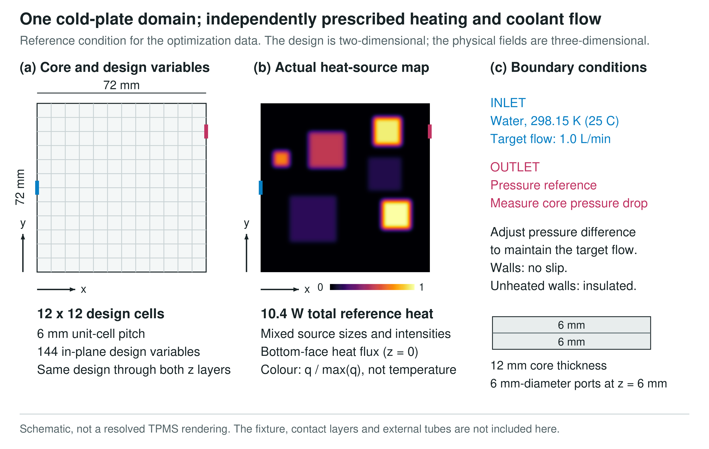
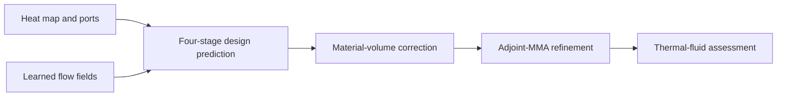

# TPMS Cold-Plate Design

### Heat-map-driven design with simulation and learned warm starts

A research project on **spatially graded TPMS cooling plates** for nonuniform heat loads. The workflow combines unit-cell homogenization, coupled flow and heat-transfer analysis, adjoint optimization, and a flow-informed neural model that proposes an initial design.

**Thermal-fluid simulation · Adjoint optimization · PyTorch · Cellular design**

[Method](docs/METHOD.md) · [Selected results](docs/RESULTS.md) · [Project scope](#project-scope)

*Reference numerical problem: a 72 x 72 x 12 mm core, a 12 x 12 in-plane design field, and prescribed heating and coolant flow. This schematic is not a resolved lattice or a fabricated specimen.*

## Engineering question

**How should the material distribution change when the heat sources and coolant ports change?**

Uniform cellular structures are easy to parameterize, but do not adapt their local flow resistance and heat-transfer properties to a particular heat map. Here, a spatial porosity field controls the local TPMS geometry. A learned model supplies a starting point; physics-based optimization performs the final refinement.

## Workflow

1. **Model the material.** Unit-cell calculations supply effective properties for a homogenized cooling-plate model.
2. **Learn from optimization.** A shared CNN updates the design in four stages. A fixed U-Net predicts flow information from the current design at each stage.
3. **Refine with physics.** The proposed design is transferred to the simulation model and adjusted under the same material-volume and flow conditions.

## Selected numerical results

| Question | Observation |
| :--- | :--- |
| Does flow information improve the predicted design? | **9.2% lower design RMSE** than a CNN-only four-stage model on 52 development groups, across three training seeds. |
| Does a learned initial design reduce optimization work? | Flow-informed initialization required **31.9 vs 104.7 PDE solves** on average to reach the reference target in the 11 evaluable problems. |
| Does the flow-informed staged model save more solves than other learned starts? | An additional saving over CNN-only or flow-informed one-shot initialization was **not statistically resolved**. |

The cost study included **12 problems** and one training seed. Every method reached the evaluation target in 11; one problem had no numerically established reference target. The reported means use the same 11 problems and include native verification solves. These are results of the **homogenized numerical model**, not a claim of experimentally demonstrated cooling improvement. [Evaluation details and remaining validation](docs/RESULTS.md).

## Project scope

This repository presents selected methods and numerical results from ongoing research. It is a **research overview**, not the complete solver, training dataset, or a manufacturing-ready release. Resolved-geometry CFD, mesh uncertainty, and fabrication-based performance comparisons remain separate validation tasks.

| Included here | Outside this release |
| :--- | :--- |
| Problem definition and method overview | Full optimization and training implementation |
| Selected numerical comparisons | Raw case archives and model checkpoints |
| A representative domain figure | Fabrication files and final experimental claims |

## Research context

Maintained by **Eui-Hyun Kim**, Seoul National University of Science and Technology.

For related published work on generative structural design, see [HF-TopoDiff](https://github.com/dsfsazxc/hf-topodiff) and its [JCDE paper](https://doi.org/10.1093/jcde/qwag055). That publication is a separate study, not the publication record for this ongoing project.
